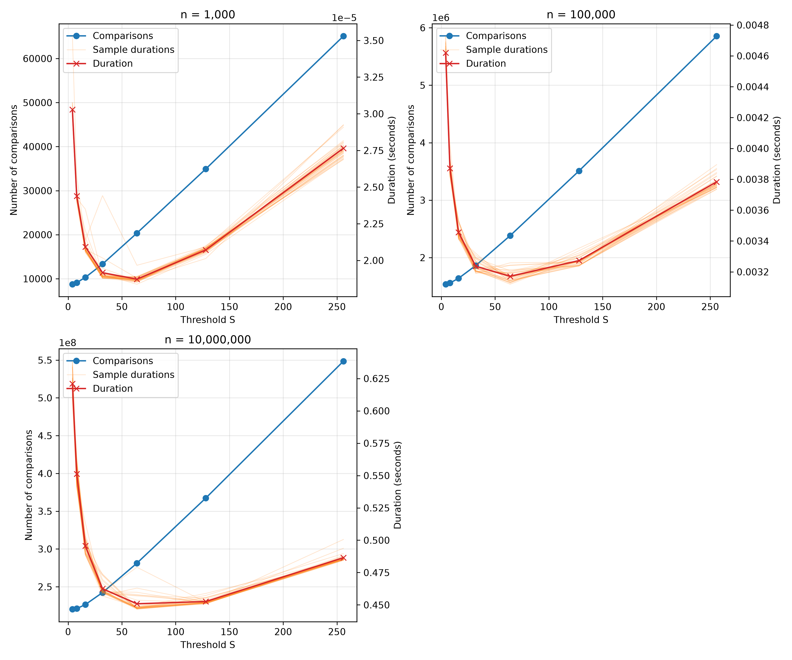
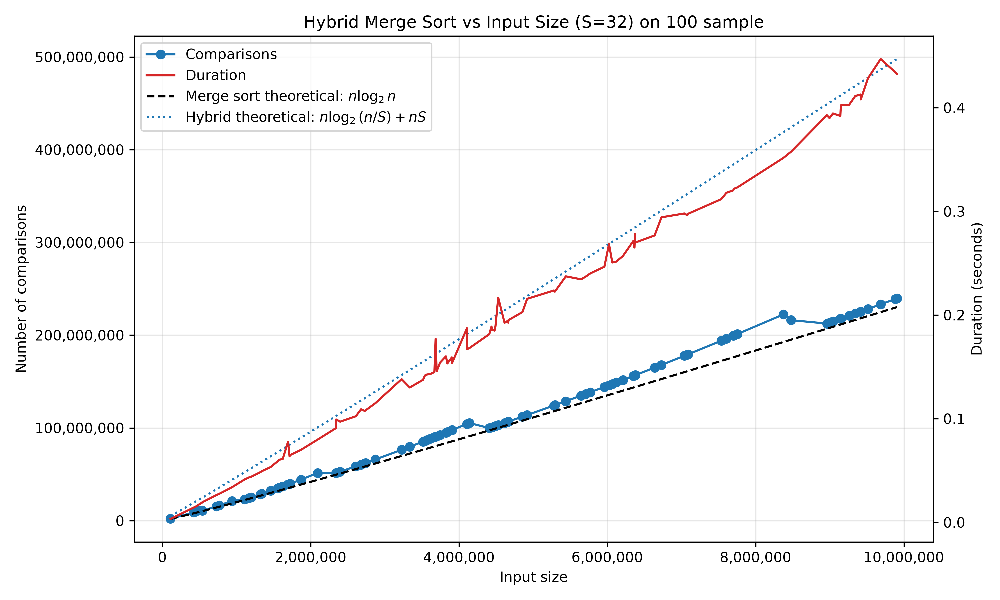
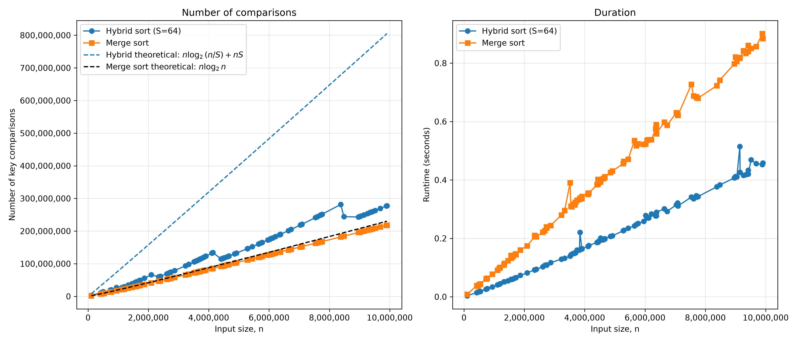

# Hybrid Merge Sort Benchmark

This project implements and benchmarks a hybrid merge sort algorithm. It uses
merge sort for large subarrays and switches to insertion sort when the subarray
size is at or below a chosen threshold, `S`.

The project is built around Python, which handles data generation,
benchmarking, plotting, and backend selection. The core sorting algorithm is
implemented in both Python and C++ (for faster experiments on large
datasets).

The program measures:

- Number of key comparisons
- Sorting duration
- Performance across different input sizes and threshold values
- Hybrid sort performance against standard merge sort

## Setup

Python 3.10 or newer is required.

```bash
python -m venv .venv
```

Activate the virtual environment on macOS or Linux:

```bash
source .venv/bin/activate
```

On Windows:

```bash
.venv\Scripts\activate
```

Install the required Python packages:

```bash
pip install -r requirements.txt
```

## Running

Run the project using the Python implementation:

```bash
python main.py
```

Choose which experiment to run by using the function calls at the bottom
of `main.py`:

- `plot_over_input_size(...)` plots performance against input size.
- `plot_over_s(...)` plots performance against threshold `S`.
- `compare_hybrid_merge(...)` compares hybrid sort with merge sort.

Generated plots are saved in the `outputs` directory. If you encounter errors
when enabling C++, refer to the next section.

## C++ Implementation (Optional)

Python alone is enough to run the entire project. It does not require a C++
compiler, although large experiments will run more slowly.

To use the faster C++ sorting implementation, add the `-cpp` flag:

```bash
python main.py -cpp
```

The project loads and compiles the C++ implementation using the Python package
`cppimport`. If C++ compilation or loading fails, the program automatically
falls back to the Python implementation.

Using the C++ implementation requires a C++ compiler. On Windows, you may be
prompted to install Microsoft Visual C++ (MSVC) if the necessary build tools
are missing. Go ahead with the MSVC installation to use C++ for this project.

## Results

The plots below were generated with the C++ backend. The arrays hold random
integers in `[1, 10^9)`. All durations come from a single machine, so small
spikes in the duration curves are timing noise.

### Choosing the threshold S



`plot_over_s(30, [1000, 100_000, 10_000_000], [4, 8, 16, 32, 64, 128, 256])`
sorts 30 arrays for each size and threshold. The thick line is the average and
the faint lines are individual samples.

- **Comparisons rise steadily with S.** Insertion sort makes about `S²/4`
  comparisons on a random subarray of size `S`, so larger subarrays quickly
  cost more than merging them would.
- **Duration is U-shaped, with its minimum at S = 64 for all three sizes.** At
  n = 10,000,000, S = 64 takes about 0.45 s against about 0.62 s at S = 4,
  roughly 27% faster. S = 128 is almost as fast.
- **Comparison count does not predict runtime.** Insertion sort's comparisons
  are cheap: they swap neighbouring elements in memory the CPU already has
  cached, and they allocate nothing. Every merge copies both halves into new
  vectors, so removing the smallest merges saves more time than the extra
  comparisons cost, up to about S = 64.

### Hybrid sort against input size (S = 32)



`plot_over_input_size` sorts 100 arrays with sizes between 1,000 and
10,000,000.

- **Comparisons grow like `n log n`.** They stay slightly above the
  `n log₂ n` line (about 240M against 232M at n = 10M). The extra comes from
  insertion sort on the size-32 subarrays.
- **The hybrid theoretical curve `n log₂(n/S) + nS` sits well above the data**
  (about 500M at n = 10M). It is an asymptotic bound whose `nS` term has no
  constant factor. On random input, insertion sort costs closer to `nS/4`.
- **The count drops slightly at n ≈ 4.19M and n ≈ 8.39M.** These sizes are
  `32 × 2^17` and `32 × 2^18`. Just below them, recursion stops at subarrays
  of about 32 elements, the most expensive case for insertion sort. Just
  above, one more split happens and the subarrays shrink to about 16, so
  comparisons fall even though n grew.
- **Duration grows almost linearly**, reaching about 0.43 s at n = 10M.

### Hybrid sort against merge sort (S = 64)



`compare_hybrid_merge` runs both algorithms on the same 100 arrays. Merge sort
is the hybrid algorithm with `S = 1`.

- **Merge sort makes fewer comparisons**, about 218M at n = 10M. This sits just
  under its `n log₂ n` bound. Hybrid sort makes about 278M, roughly 27% more.
- **Hybrid sort is about twice as fast** (about 0.46 s against 0.89 s at
  n = 10M), and the gap widens as n grows.
- The same drops at `64 × 2^16` and `64 × 2^17` appear in the hybrid
  comparison curve, for the same reason as above.

### Conclusion

A threshold of about **S = 64** gives the fastest hybrid merge sort at every
input size tested. It halves the runtime of plain merge sort even though it
performs more key comparisons. Counting comparisons captures the algorithm's
asymptotic cost, but real runtime also depends on memory allocation, copying,
and cache behaviour, which favour insertion sort on small subarrays.

## Files

- `main.py` contains the benchmarking and plotting code.
- `algorithms.py` contains the Python sorting implementation.
- `algorithms_cpp.cpp` contains the C++ sorting implementation.
- `sorting_interface.py` selects the Python or C++ backend.
- `data_generator.py` generates random datasets.
